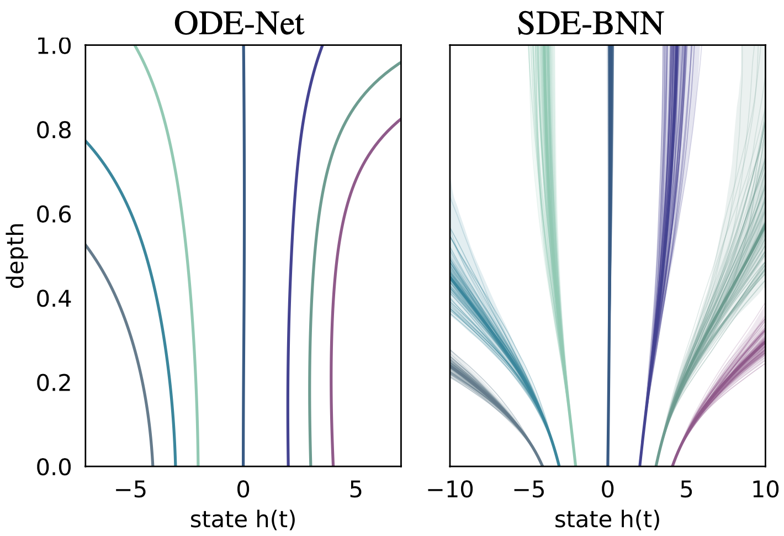
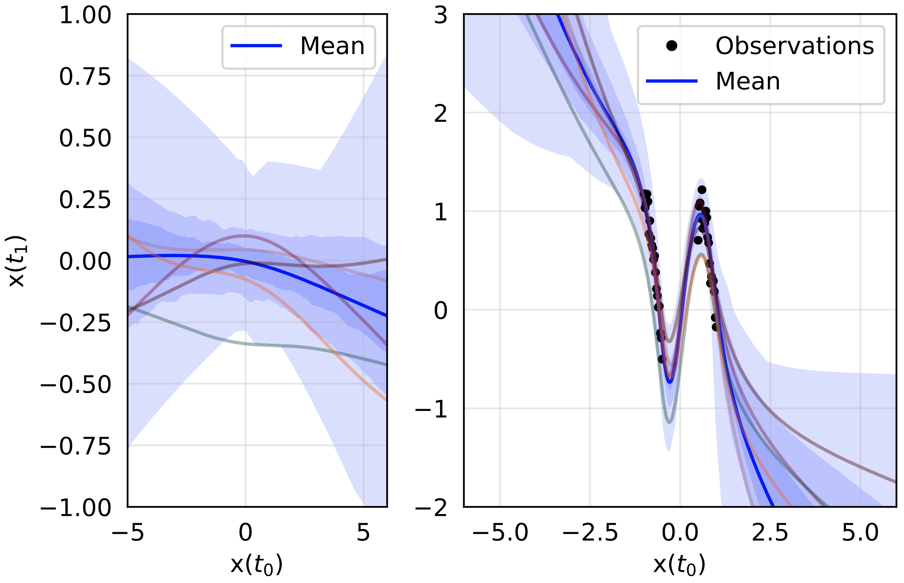

# Infinitely Deep Bayesian Neural Networks with SDEs

This library contains JAX and Pytorch implementations of neural ODEs and Bayesian layers for stochastic variational inference. 
A rudimentary JAX implementation of differentiable SDE solvers is also provided, refer to [torchsde](https://github.com/google-research/torchsde) [2]
for a full set of differentiable SDE solvers in Pytorch and similarly to [torchdiffeq](https://github.com/rtqichen/torchdiffeq) [3] for differentiable ODE solvers.

<p align="center">

<figcaption>Continuous-depth hidden unit trajectories in Neural ODE vs uncertain posterior dynamics SDE-BNN.</figcaption>
</p>

## Installation
This library runs on `jax==0.1.77` and `torch==1.6.0`. To install all other requirements:
```
pip install -r requirements.txt
```
_Note_: Package versions may change, refer to official JAX installation instructions [here](https://github.com/google/jax#installation).

## JaxSDE: Differentiable SDE Solvers in JAX
The `jaxsde` library contains SDE solvers in the Ito and Stratonovich form. 
Solvers of different orders can be specified with the following `method={euler_maruyama|milstein|euler_heun}` (orders 1|1.5|2). 
Stochastic adjoint (`sdeint_ito`) training mode does not work efficiently yet, use `sdeint_ito_fixed_grid` for now.
Tradeoff solver speed for precision during training or inference by adjusting `--nsteps <# steps>`.

### Usage
Default solver:
Backpropagation through the solver.
```
from jaxsde.jaxsde.sdeint import sdeint_ito_fixed_grid

y1 = sdeint_ito_fixed_grid(f, g, y0, ts, rng, fw_params, method="euler_maruyama")
```

Stochastic adjoint:
Using O(1) memory instead of solving an adjoint SDE in the backward pass.
```
from jaxsde.jaxsde.sdeint import sdeint_ito

y1 = sdeint_ito(f, g, y0, ts, rng, fw_params, method="milstein")
```

## Brax: Bayesian SDE Framework in JAX
Implementation of composable Bayesian layers in the [stax](https://jax.readthedocs.io/en/latest/jax.experimental.stax.html) API.
Our SDE Bayesian layers can be used with the `SDEBNN` block composed with multiple parameterizations of time-dependent layers in `diffeq_layers`.
Sticking-the-landing (STL) trick can be enabled during training with `--stl` for improving convergence rate.
Augment the inputs by a custom amount `--aug <integer>`, set the number of samples averaged over with `--nsamples <integer>`.
If memory constraints pose a problem, train in gradient accumulation mode: `--acc_grad` and gradient checkpointing: `--remat`. 

<p align="center">

<figcaption>Samples from SDEBNN-learned predictive prior and posterior density distributions.</figcaption>
</p>

### Usage
All examples can be swapped in with different vision datasets and includes tensorboard logging for critical metrics.

#### Toy 1D regression to learn complex posteriors:
```
python examples/jax/sdebnn_toy1d.py
```

#### Image Classification:
To train an SDEBNN model:
```
python examples/jax/sdebnn_classification.py --output <output directory> --model sdenet --aug 2 --nblocks 2-2-2 --diff_coef 0.2 --fx_dim 64 --fw_dims 2-64-2 --nsteps 20 --nsamples 1
```
To train a ResNet baseline, specify `--model resnet` and for a Bayesian ResNet baseline, specify `--meanfield_sdebnn`.

## Torchsde: SDE-BNN in Pytorch
A PyTorch implementation of the Brax framework powered by the [torchsde](https://github.com/google-research/torchsde) backend.

### Usage
All examples can be swapped in with different vision datasets and includes tensorboard logging for critical metrics.

#### Toy 1D regression to learn multi-modal posterior:
```
python examples/torch/sdebnn_toy1d.py --output_dir <dst_path> --ds b40gap --diff_const 0.2 --prior_dw ou --num_samples 100 --stl
```
<p align="center">

<figcaption>Arbitrarily expression approximate posteriors from learning non-Gaussian marginals.</figcaption>
</p>

#### Image Classification:
All hyperparameters can be found in the training script.
```
python examples/torch/sdebnn_classification.py --train-dir <output directory> --data cifar10 --dt 0.05 --method midpoint --adjoint True
--inhomogeneous True
```

## References
[1] Winnie Xu, Ricky T. Q. Chen, Xuechen Li, David Duvenaud. "Infinitely Deep Bayesian Neural Networks with Stochastic Differential Equations." *Preprint* 2021. [[arxiv]]()

[2] Xuechen Li, Ting-Kam Leonard Wong, Ricky T. Q. Chen, David Duvenaud. "Scalable Gradients for Stochastic Differential Equations." *AISTATS* 2020. [[arxiv]](https://arxiv.org/abs/2001.01328)

[3] Ricky T. Q. Chen, Yulia Rubanova, Jesse Bettencourt, David Duvenaud. "Neural Ordinary Differential Equations." *NeurIPS.* 2018. [[arxiv]](https://arxiv.org/abs/1806.07366)